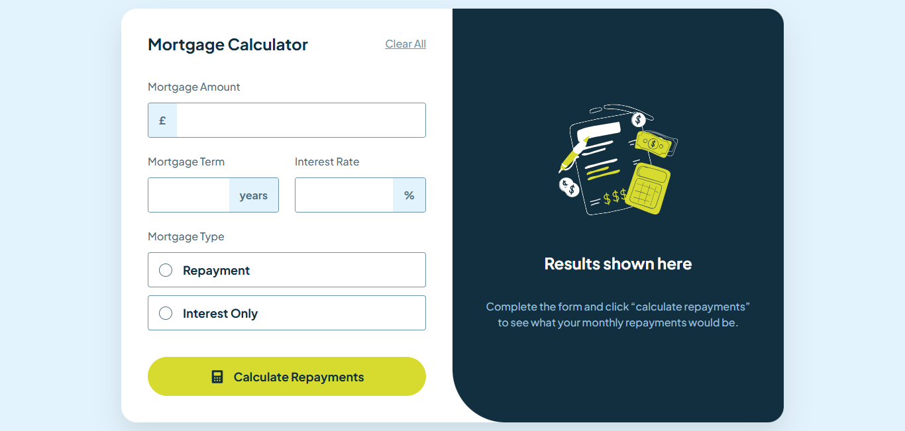

# Frontend Mentor - Mortgage repayment calculator solution

This is a solution to the [Mortgage repayment calculator challenge on Frontend Mentor](https://www.frontendmentor.io/challenges/mortgage-repayment-calculator-Galx1LXK73). Frontend Mentor challenges help you improve your coding skills by building realistic projects.

## Table of contents

- [Overview](#overview)
  - [The challenge](#the-challenge)
  - [Screenshot](#screenshot)
  - [Links](#links)
- [My process](#my-process)
  - [Built with](#built-with)
  - [What I learned](#what-i-learned)
- [Author](#author)

## Overview

### The challenge

Users should be able to:

- Input mortgage information and see monthly repayment and total repayment amounts after submitting the form
- See form validation messages if any field is incomplete
- Complete the form only using their keyboard
- View the optimal layout for the interface depending on their device's screen size
- See hover and focus states for all interactive elements on the page

### Screenshot

### Links

- Solution URL: [Frontend Mentor Solution](https://www.frontendmentor.io/solutions/mortgage-repayment-calculator-HNuB77gJXW)
- Live Site URL: [Mortgage Repayment Calculator](https://mortgage-rep-calculator.netlify.app/)

## My process

### Built with

- Semantic HTML5 markup
- CSS custom properties
- Flexbox
- Mobile-first workflow
- [React](https://reactjs.org/) - JS library
- classnames - A simple JavaScript utility for conditionally joining classNames together.

### What I learned

- Built fully controlled inputs (text + radio) and lifted the form data up so `App` can calculate and reset results in one place.
- Added simple validation and inline error messaging per field, clearing errors as the user edits for a smoother UX.
- Used `classnames` with a BEM-ish naming scheme to toggle modifiers for focus, error, and selected states without extra libraries.
- Practiced accessible labeling (`label` + `htmlFor`) and keyboard-friendly controls, including custom radios via `appearance: none` and pseudo-elements.

## Author

- Frontend Mentor - [@gustavo2023](https://www.frontendmentor.io/profile/gustavo2023)
